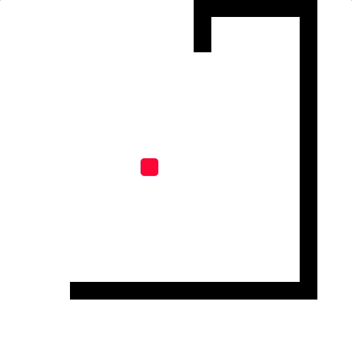

<p align="center">
  <a href="https://github.com/sid-sr/Q-Snake">
    
  </a>
</p>

<p align="center">
    <h1 align='center'> Q-Snake </h1>
</p>
<h4 align='center'>An interactive Q-learning web visualiser for Snake built with React.js </h4>

<p align="center">
  <a href='https://lbesson.mit-license.org/'>
  
</p>

<p align="center">
  <a href="#about">About</a> •
  <a href="#features">Features</a> •
  <a href="#usage">Usage</a> •
  <a href="#installation">Installation</a> •
  <a href="#acknowledgements">Acknowledgements</a>
</p>
 
---
## About

<table>
<tr>
<td>

• A website that visualises the Q-learning RL algorithm and shows how an AI agent can learn to play Snake using it. <br>
• Built using [create-react-app](https://github.com/facebook/create-react-app) and uses no reinforcement learning libraries/environments. <br>
• Uses a simplified state representation to ensure learning is fast, this converts it into more of a planning problem than RL, but the goal was just to visualise the RL algorithm within a reasonable training duration.
</td>
</tr>
</table>


## Features



<h4>State Space:</h4>

* Using just 2 values to represent a state, which are:
* Relative location of the apple to the head (8 directions)
* Presence of danger one step ahead of the head in 4 directions (array of 4 numbers, which results in 16 values).
* This results in a **16 x 8 x 4** Q-table.

<h4>Reward Space:</h4>

<table class="tg">
<thead>
  <tr>
    <th class="tg-baqh">Condition</th>
    <th class="tg-0lax">Reward</th>
  </tr>
</thead>
<tbody>
  <tr>
    <td class="tg-0lax">Hitting the border / eating itself / moving 500 steps without eating the apple</td>
    <td class="tg-0lax"><span style="font-weight:bold">+100</span></td>
  </tr>
  <tr>
    <td class="tg-0lax">Eating the apple</td>
    <td class="tg-0lax"><span style="font-weight:bold">+30</span></td>
  </tr>
  <tr>
    <td class="tg-0lax">Moving towards the apple</td>
    <td class="tg-0lax"><span style="font-weight:bold">+1</span></td>
  </tr>
  <tr>
    <td class="tg-0lax"><span style="font-weight:400;font-style:normal">Moving away from the apple</span></td>
    <td class="tg-0lax"><span style="font-weight:bold">-5</span></td>
  </tr>
</tbody>
</table>

(Used the state and reward space followed in this video: [AI learns to play Snake using RL](https://youtu.be/8cdUree20j4))

## Usage
#### The following parameters can be set before running the algorithm: 
1. <b>Episodes</b>: The number of episodes (games/trials) to play and learn from. 
2. <b>Start Epsilon</b>: The initial probability of exploration. Ranges from 0 to 1.
3. <b>End Epsilon</b>: The final probability of exploration. Ranges from 0 to 1.
4. <b>Discount Factor</b>: The importance given to delayed rewards compared to immediate rewards. Ranges from 0 to 1.
5. <b>Speed/Delay</b>: The delay (in ms) between the moves, lesser values mean faster games (set to lowest value when training).

* The <b>Train</b> button starts training, <b>Stop</b> stops the game and <b>Test</b> shows how the agent plays without training the agent (useful to see how a trained agent plays).
* The [probability of exploration](https://www.oreilly.com/library/view/hands-on-reinforcement-learning/9781788836524/0c14fb24-1926-4cc3-8bf6-818cae23bde2.xhtml) decreases linearly over the number of episodes given. So the agent moves randomly at the start and explores the state space and towards the end of the training phase (and during testing) it takes informed decisions based on the learned Q values for each state. 

## Installation
#### If you would like to tweak the algorithm locally:

* Clone the repository.
* Run ```npm -i install```.
* Run ```npm start```.

## Acknowledgements

* [Coding Snake in React.js](https://youtu.be/-oOgsGP3t5o)
* Excellent explanation on how different rewards can affect the time taken to converge to the optimal Q values: [AI learns to play Snake using RL](https://youtu.be/8cdUree20j4)